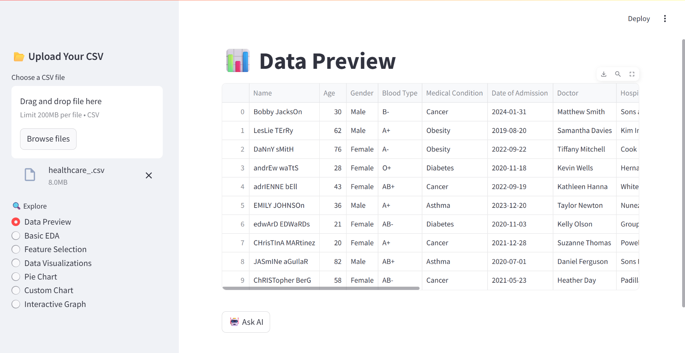
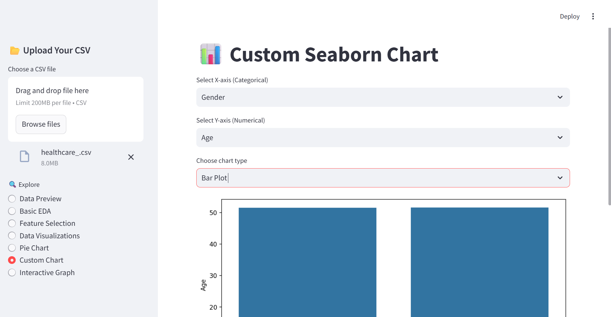

# ⚡ AI-Driven Data Explorer

**From raw data to insights at lightning speed.**  
A modern Streamlit-based tool that supercharges your data workflows with automated EDA, feature selection, dynamic visualizations, and a powerful **AI chatbot** that responds to your CSV-related questions using OpenAI's GPT model.

---

## 🚀 Features

✅ **Data Preview** – instantly explore uploaded CSVs  

✅ **Basic EDA** – understand shape, nulls, datatypes, summary stats  
✅ **Feature Selection** – using Mutual Information for classification targets  
✅ **Data Visualizations** – heatmaps, distributions, pie charts, and more
DataVisualisation.png  
✅ **Custom Charts** – choose your X/Y axes, select chart types (Seaborn)
  
✅ **Interactive Graphs** – filterable, grouped insights (Plotly)  
✅ **🧠 AI Chatbot** – ask anything about your dataset and get instant insights  

---

## 📂 Folder Structure

project-root/
│
├── app.py
├── utils/
│ ├── eda_utils.py
│ ├── feature_utils.py
│ ├── viz_utils.py
│ └── llm_agent.py
│
├── assets/
│ ├── screenshot_main.png
│ ├── screenshot_eda.png
│ ├── screenshot_charts.png
│
├── requirements.txt
└── .env # For storing OPENAI_API_KEY


---

## 🧰 Installation

1. **Clone the repo**
```bash
git clone https://github.com/smrutiranjan1132001/fast-eda.git
cd fast-eda
pip install -r requirements.txt

Set your OpenAI API key

Create a .env file:
OPENAI_API_KEY=your-openai-key-here

Run the App
streamlit run app.py